# ML2Scratch(Scratch2ML)

ML2Scratch connects Machine Learning([TensorFlow.js](https://www.tensorflow.org/js)) with Scratch.

If you take a few images with a webcam, label them, and learn them, you can classify similar new images based on the learning results. The captured images are not sent to the server, and all learning and classification are performed in the browser. (However, a network connection is required to load the application at startup and to download the learning model.)

The block languages are English, Japanese, Japanese, Simplified Chinese(provided by 陶旭 https://twitter.com/taoxu_toukyoku), and Traditional Chinese(provided by
CAVEDU Education https://github.com/cavedunissin). If you would like to help us translate into other languages, please open an issue or contact us.

*Read this in other languages: [English](README.en.md), [日本語](README.md), [简体中文](README.zh-cn.md).*

[ML2Scratch Website](https://champierre.github.io/ml2scratch/)

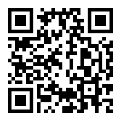

## Demo Movie

### Learn/Classify Scratch stage images

  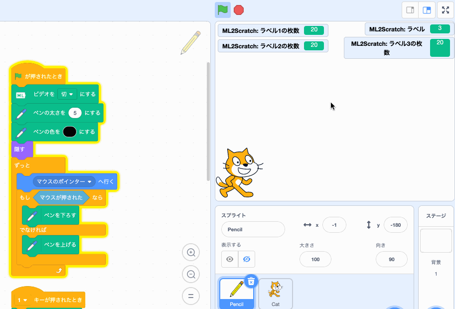

- [handwriting(1or2) recognition sample project](https://github.com/champierre/ml2scratch/blob/master/sample_projects/1or2.sb3?raw=true)
- [handwriting(1or2) recognition learning data](https://github.com/champierre/ml2scratch/blob/master/sample_projects/1or2.json?raw=true)

### Learn/Classify Scratch webcam images

  

#### Other samples

- Rock/Scissors/Paper Demo [YouTube](https://www.youtube.com/watch?v=DkH1hwc-Gb4) | [.mov file](https://s3.amazonaws.com/champierre/movies/rsp_demo.mov)
- Control a toy robot, MiP, by hand gestures [YouTube](https://www.youtube.com/watch?v=GKXimEB5WQg) | [.mov file](https://s3.amazonaws.com/champierre/movies/mip_demo.mov)

## Licence

- ML2Scratch is under [BSD 3-Clause License](./LICENSE.md), open source and freely available to anyone. You can use it at your classes, workshops. Commercial usage is also accepted. If you or your students created something cool using ML2Scratch, please share it on SNS using hashtag #ml2scratch or let me know to any of these contacts. Interesting projects will be added to the "Examples of use".

## Contacts

- Twitter

    

## Examples of use

- [Try to avoid obstacles with machine learning # ML2Scratch # ev3(Google Translated)](https://translate.google.com/translate?hl=&sl=auto&tl=en&u=https%3A%2F%2Fwww.ogaworks.com%2Farchives%2F11301&sandbox=1)
- [Control Wagara-saurus(Japanese style dinosaur) using ML2Scratch](https://www.facebook.com/azusa.amino/videos/2408305165934138/)
- [Control an electric fan with illustration](https://www.facebook.com/groups/scratch.microbit/permalink/704715526600743/)
- [Smart Trash Box(Japanese)](https://robotstart.info/2019/10/20/jjpc-4thprog-competition.html)
- [Making a coin sorting AI robot with Scratch and micro:bit](http://make-lab.sakura.ne.jp/wordpress/2019/10/12/making-a-coin-sorting-ai-robot-with-scratch-and-micro-bit/)
- [Go forward with jasmine bottle, go backward with canned coffee (movie)](https://www.facebook.com/groups/visualprogramming.jp/permalink/531024724134426/)
- [ML2Scratch bookshelf arrangement check (movie)](https://www.youtube.com/watch?v=ZQ88E6HSUdg)
- [ML2Scratch detects parking space fullness (movie)](https://www.youtube.com/watch?v=vZwfN18op8w)

## Requirements

- OS
  - Windows 8
  - Windows 10
  - MacOS
  - Chrome OS
  - iOS
- Browser
  - Chrome
  - Safari(iOS)

ML2Scratch sometimes does not work because of some Chrome extensions. Plese switch to [Guest Mode](https://support.google.com/chrome/answer/6130773) in such cases.

## How to use(Step by step)

### Setup

1. Open [https://stretch3.github.io/](https://stretch3.github.io/).

2. Open "Choose an Extension" window and select "ML2Scratch".

    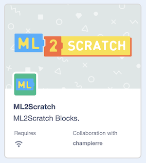

3. Chrome asks you to allow the access to Camera, then click "Allow".

4. Check the checkboxes besides "label", "counts of label 1", "counts of label 2" and "counts of label 3" blocks.

    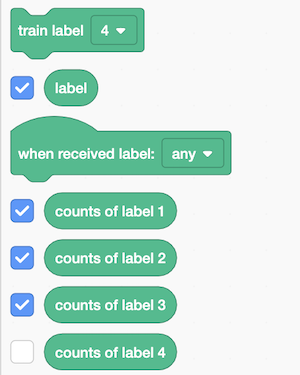

### Training

5. Show "rock" hand sign to the camera and click "train label 1" block. This is to train the machine to recognize "rock" sign as label 1.

    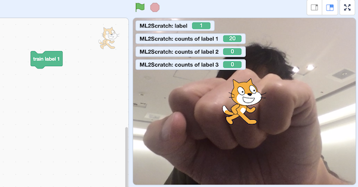

6. Keep clicking the button until you capture about 20 images. The number of images captured is displayed in "counts of label 1" field in Stage window.

7. Show "paper" hand sign to the camera and keep clicking "train label 2" block until you get 20 as "counts of label 2".

8. Show "scissors" hand sign to the camera and keep clicking "train label 3" block until you get 20 as "counts of label 3".

### Recognition

9. After training, the recognition result shows in the "label" field in Stage area. If you show "rock", the "label" should show "1", if you show "paper", the "label" should show "2" and if you show "scissors", the "label" should show "3".

    

10. You can use "when received label #" blocks and create a sample program like this:

    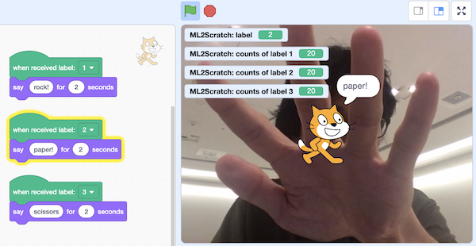

### Switching between images to be learned/classified

You can switch the images to be learned/classified.

By default, Scratch's stage image is used for learning/classification.

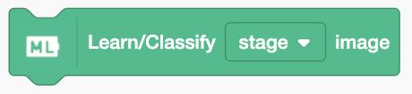

If there is a webcam image on the stage, it learns/classified the webcam image, or if the "Turn off video" block stops showing the webcam image and shows a game or animation screen, etc., it uses that screen for learning/classfication.

If you want to learn/classify only the webcam's image, you can use

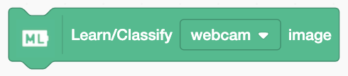

It can be switch to a webcam image for learning/classification. If you want to move the character by gestures on the camera image, I think this is a more accurate way to judge.


### Download/Upload

With ML2Scratch, you can download and save the trained model on your PC by using the "download learning data" block.


Click, specify the file download destination, and press the "Save" button. The learning data will be saved as a file &lt;numerical string&gt;.json.

The project itself is not saved automatically like a normal Scratch, so select "File" > "Save to your computer" and save it on your PC as a .sb3 file.

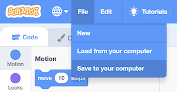

To reopen a saved project, choose "File" > "Load from your computer" and select the saved .sb3 file. After that, upload the learning data.

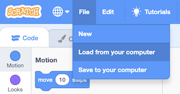

The saved learning data can be uploaded in the "upload learning data" block.

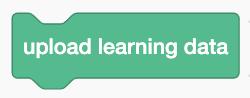

When you click, a window called "upload learning data" opens, so click the "Select file" button, select the training data file (&lt;numerical sequence&gt;.json), and press Click.

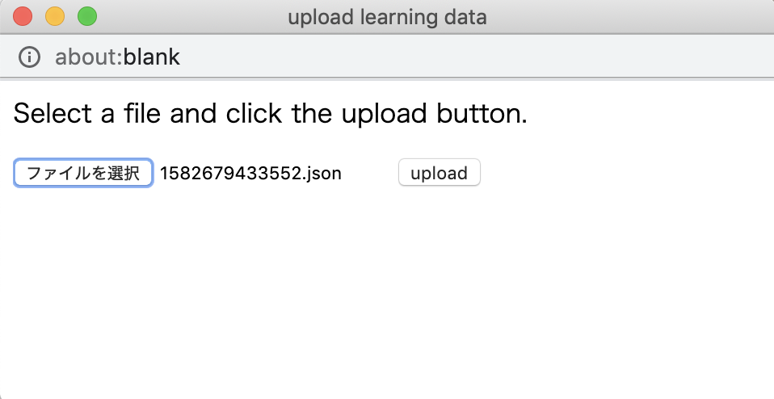

At this time, be aware that the data that has been learned will be overwritten.

## For Developers - How to run ML2Scratch extension on your computer

1. Setup LLK/scratch-gui on your computer.

    ```
    % git clone git@github.com:LLK/scratch-gui.git
    % cd scratch-gui
    % npm install
    ```

2. In scratch-gui folder, clone ML2Scratch. You will have ml2scratch folder under scratch-gui.

    ```
    % git clone git@github.com:champierre/ml2scratch.git
    ```

3. Run the install script.

    ```
    % sh ml2scratch/install.sh
    ```

4. Run Scratch, then go to http://localhost:8601/.

    ```
    % npm start
    ```

## Reference

- [https://js.tensorflow.org/](https://js.tensorflow.org/)
- [https://github.com/googlecreativelab/teachable-machine-boilerplate](https://github.com/googlecreativelab/teachable-machine-boilerplate)
