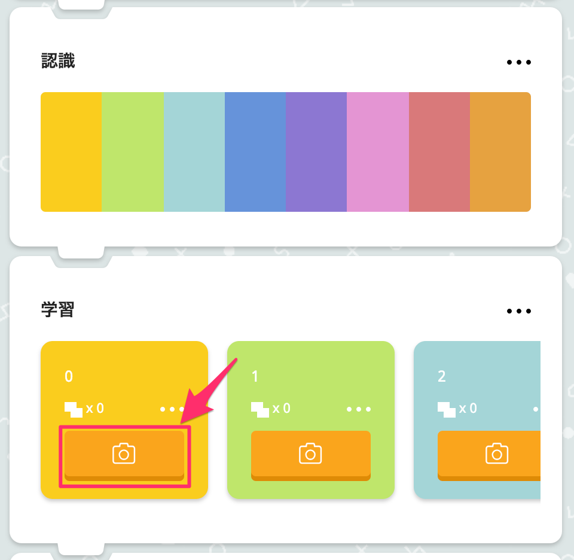
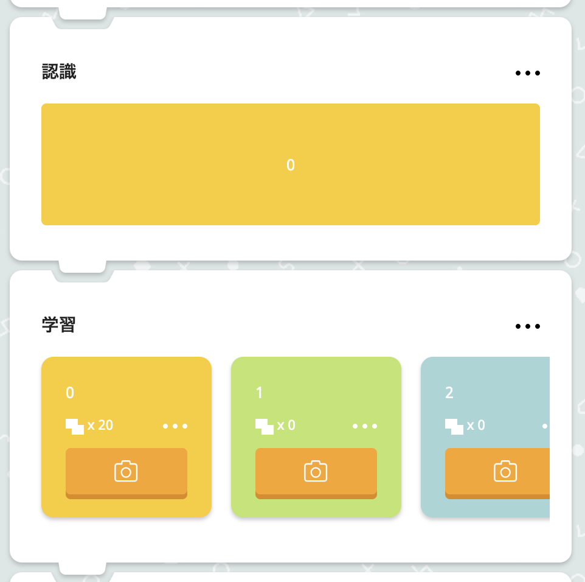
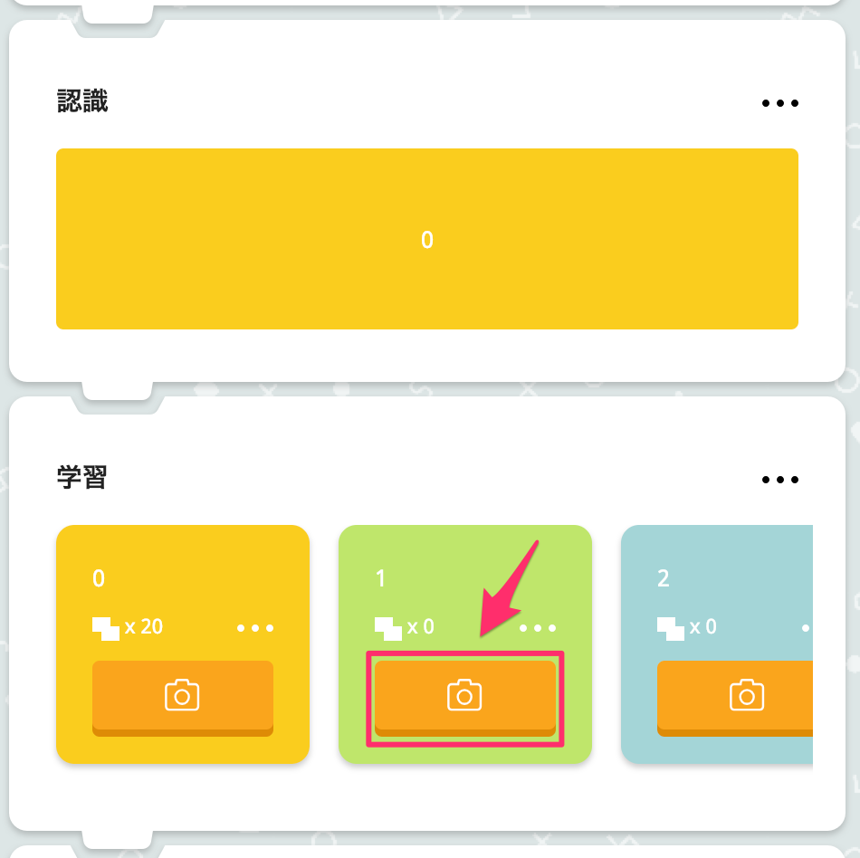
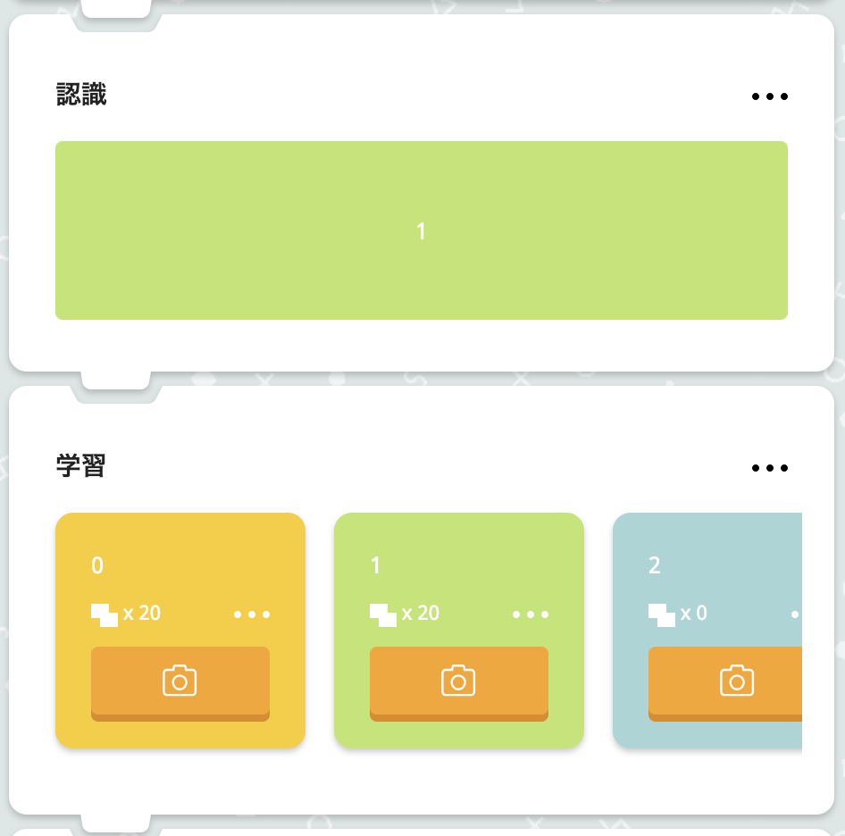
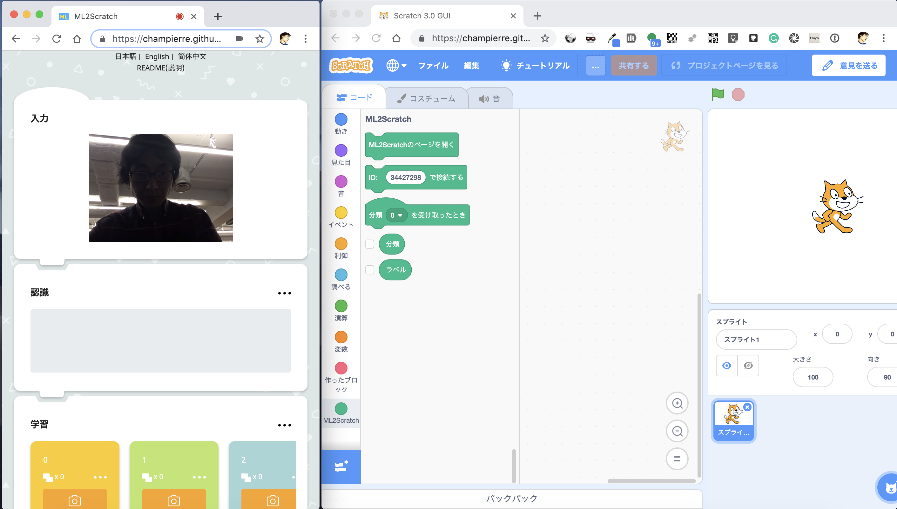
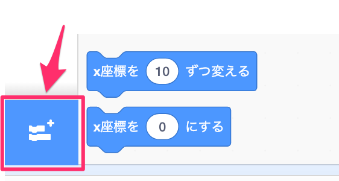
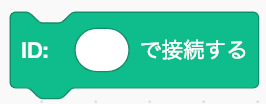
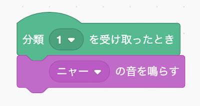
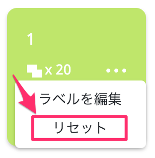
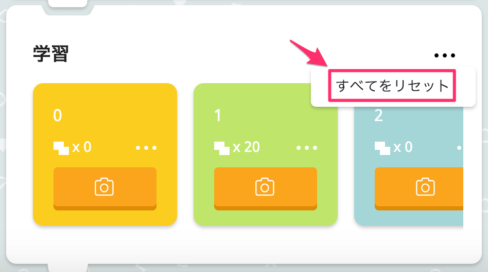

# ML2Scratch(Scratch2ML)

ML2Scratchは機械学習(TensorFlow.js)をScratchとをつなげます。

*他の言語で読む: [English](README.md), [日本語](README.ja.md), [简体中文](README.zh-cn.md).*

## 環境

- Chromeブラウザ

## デモ動画

- Webカメラでグー、チョキ、パーを判定 [YouTube](https://www.youtube.com/watch?v=DkH1hwc-Gb4) | [.mov file](https://s3.amazonaws.com/champierre/movies/rsp_demo.mov)
- ジェスチャーで倒立2輪ロボットMiPを動かす [YouTube](https://www.youtube.com/watch?v=GKXimEB5WQg) | [.mov file](https://s3.amazonaws.com/champierre/movies/mip_demo.mov)

## 使い方

1. https://champierre.github.io/ml2scratch/ を開きます。ウェブカメラへのアクセスを求められたら、許可します。

2. まず最初に学習用の画像を数枚用意します。たとえば、ウェブカメラに顔が映るように座り、何もしていない状態を撮ります。

    

3. 「学習」セクション内、黄色のパネル(ラベル:0)の上のカメラアイコンのボタンをクリックし続けて、ラベル番号0として認識される画像をキャプチャします。

    

    20枚ほどキャプチャすると、「認識」セクション内のバーが黄色になります。これは、何もしていない姿の画像が、100パーセントの確からしさでラベル0として認識されていることを示しています。

    

4. 次に、別のポーズを取った姿の画像を用意します。

    

5. 「学習」セクション内、今度は薄緑色のパネル(ラベル:1)の上のカメラアイコンのボタンをクリックし続けて、ラベル番号1として認識される画像をキャプチャします。

    

    20枚ほどキャプチャすると、「認識」セクション内のバーが薄緑色に変わります。これは、ポーズを取った姿の画像が、100パーセントの確からしさでラベル1として認識されていることを示しています。(もしかしたら80%-90%薄緑色という状態になるかもしれませんが、70%以上であれば問題ありません)

    

6. ウェブカメラの前で取るポーズに応じて「認識」セクションに表示されるラベルの色が変化することを確認してください。もし最初の何もしていないポーズを取ったときは黄色に、次のポーズを取ったときには薄緑色に変わるはずです。

7. ページの下までスクロールし、「接続」セクションに表示されている接続ID(「76q669zsk」といったランダムな文字列)をコピーします。この接続IDは後になって利用します。その横の「接続」ボタンをクリックし、クラウド上にあるWebSocket(ウェブソケット)サーバーに接続します。

    

8. 「Scratchを開く」ボタンをクリックして、ML2Scratchの拡張機能を利用可能な独自Scratchの画面を開きます。

    

    <span style="color:red;">【注意】ML2ScratchとScratchは以下のキャプチャ画面のように、それぞれ別ウィンドウで開き、並べるようにしてください。同じウィンドウの異なるタブで開くと、うまく動作しません。</span>

    

9. ブラウザの別タブでScratchが開き「Scratch 3.0 ベータ版にようこそ！」の画面が開きます。「試す!」をクリックします。

    画面左下隅のフォルダアイコンをクリックして、「拡張機能を選ぶ」の画面を開きます。

    

    最後に並んでいる「ML2Scratch」を選びます。

    

    「ML2Scratch」カテゴリが追加されます。

    

10. 「ID: []で接続する」ブロックをスクリプトエリアにドラッグし、7. でコピーした接続IDをブロックの空き部分にペーストします。ペーストし終わったら、ブロックをクリックして、WebSocket(ウェブソケット)サーバーに接続します。

    

11. 「分類 [1] を受け取ったとき」ブロックをスクリプトエリアにドラッグします。「音」カテゴリにある「ニャーの音を鳴らす」ブロックをスクリプトエリアにドラッグし、以下のようにつなげます。

    

12. ラベル1として学習させたポーズを取るたびに、認識結果がWebSocket(ウェブソケット)サーバー経由でScratchに送られ、Scratchで組んだプログラムの通りニャーの音が鳴ります。

## そのほかの使い方

1. 特定のラベルに対する学習をやり直したい場合には、そのラベルのパネル上のメニュー(・・・)をクリックし、「リセット」を選びます。

    

2. もしすべての学習データをクリアしたいときには、「学習」セクションのメニュー(・・・)をクリックし、「すべてをリセット」を選びます。

    

3. 学習した結果を保存しておきたい場合には、「認識」セクションのメニュー(・・・)をクリックし、「学習済みモデルをダウンロード」を選び保存先を指定します。ファイルは「1548166739008.json」といったjsonファイルです。

    

4. 保存しておいた学習モデルをアップロードするには、「学習済みモデル」セクションの「ファイルを選択」をクリックし、あらかじめダウンロードしてあったjsonファイルを選びます。

    


## 開発環境のセットアップ方法

```
% npm install
% npm run start
```

## Tシャツ

ML2Scratchのロゴ入りTシャツ、こちらで販売しています ->
https://suzuri.jp/is8r_/1251743/t-shirt/s/white

## 参考

- https://js.tensorflow.org/
- https://github.com/googlecreativelab/teachable-machine-boilerplate
