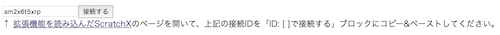
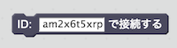
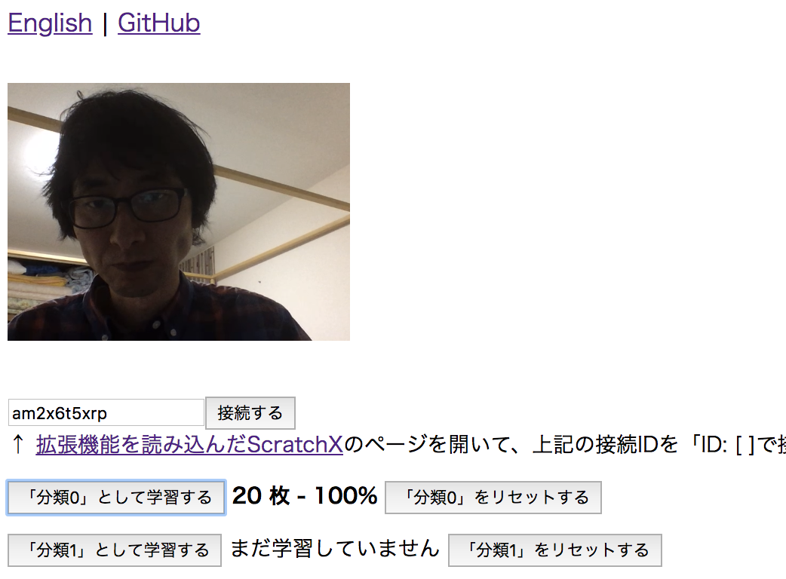
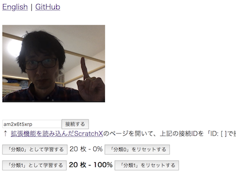

# ML2Scratch(Scratch2ML)

ML2Scratchは機械学習(TensorFlow.js)をScratchXとをつなげます。

*Read this in other languages: [English](README.md), [日本語](README.ja.md), [简体中文](README.zh-cn.md).*

## 環境

- Chromeブラウザ

## デモ動画

- Webカメラでグー、チョキ、パーを判定 [YouTube](https://www.youtube.com/watch?v=DkH1hwc-Gb4) | [.mov file](https://s3.amazonaws.com/champierre/movies/rsp_demo.mov)
- ジェスチャーで倒立2輪ロボットMiPを動かす [YouTube](https://www.youtube.com/watch?v=GKXimEB5WQg) | [.mov file](https://s3.amazonaws.com/champierre/movies/mip_demo.mov)

## 使い方

1. https://champierre.github.io/ml2scratch/ を開きます。ウェブカメラへのアクセスを求められたら、許可します。

2. 「接続する」ボタンをクリックして、サーバーに接続します。

    <kbd></kbd>

3. あとで貼り付けするために、「接続する」ボタンの横の接続ID(am2x6t5xrpといった文字列)をコピーしておきます。

4. 「拡張機能を読み込んだScratchX」のリンクをクリックして、ScratchXのページを開きます。警告ダイアログでは、「I understand, continue」をクリックしてください。

    \* 拡張機能が読み込まれた状態でScratchXを開くことができない場合は、 [ScratchX](http://scratchx.org/) ページを開いて「Open Extension URL」をクリックし、次のURLを貼り付けて「Open」をクリックしてください。

    ```
    https://champierre.github.io/ml2scratch/ml2scratch.js
    ```

5. ScratchXの画面で、「ID: [ ]で接続する」ブロックをスクリプトエリアにドラッグし、空欄の部分にさきほどコピーした接続IDを貼り付けます。貼り付けたら、ブロックをクリックしてサーバーに接続します。

    

6. 以下のようにブロックを組んで「「分類1」を受け取ったとき」「popの音を鳴らす」ようにします。

    

7. ウェブカメラの画像が写っているページに戻り、「「分類0」として学習する」ボタンをクリックし続けて、「分類0」として覚えてほしい画像を20枚ほど学習させます。ポーズをとる場合は、体を揺らすなどして、1枚ずつ微妙な違いをつくるのがコツです。

    <kbd></kbd>

8. 次に、違うポーズを取り、「「分類1」として学習する」ボタンをクリックし続けて、「分類1」として学習させます。このときも1枚ずつ微妙な違いをつくります。

    <kbd></kbd>

9. ポーズが2種類であれば、各分類ごとに20枚ほどの画像で認識するようになります。「分類0」と「分類1」の各ポーズを取ったときに、認識された方が太字となって、それぞれちゃんと認識されていることを確認してください。認識がうまくいっていない場合は、学習させる画像を増やしたり、「「分類…」をリセットする」ボタンをクリックして一度リセットしてから学習をやり直してください。

10. ScratchXとサーバーが接続していれば、ScratchXのほうにどの分類として認識されたかの情報が送られるので、「分類1」のポーズをとったときに音が鳴るはずです。

## 参考

- https://js.tensorflow.org/
- https://github.com/googlecreativelab/teachable-machine-boilerplate
