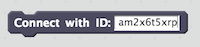
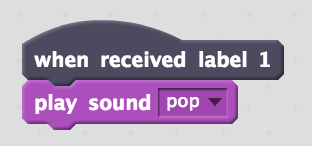
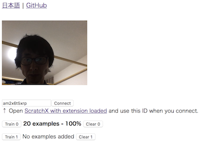

# ML2Scratch(Scratch2ML)

ML2Scratch connects Machine Learning(TensorFlow.js) to ScratchX.

*Read this in other languages: [English](README.md), [日本語](README.ja.md).*

## Requirements

- Chrome browser

## Demo Movie

- [Rock/Scissors/Paper Demo](https://s3.amazonaws.com/champierre/movies/rsp_demo.mov)
- [Control a toy robot, MiP, by hand gestures](https://s3.amazonaws.com/champierre/movies/mip_demo.mov)

## How to use

1. Open https://champierre.github.io/ml2scratch/. Allow the access to the webcam if you are asked for it.

2. Click "Connect" button to connect to the server.

    <kbd></kbd>

3. In order to paste it later, copy the connection ID(characters such as am2x6t5xrp) next to "Connect" button.

4. Click on "ScratchX with extension loaded" link to open ScratchX page. Please click "I understand, continue" in the warning dialog.

    \* If you can not open ScratchX with the extension loaded, open [ScratchX](http://scratchx.org/) page, click "Open Extension URL", and paste the following URL. Click "Open".

    ```
    https://champierre.github.io/ml2scratch/ml2scratch.js
    ```

5. On ScratchX screen, drag "Connect with ID: []" block to the script area and paste the connection ID you just copied into the blank area. Once pasted, click the block to connect to the server.

    

6. Connect blocks as follows so that "When received label 1", "play sound pop".

    


7. Back to the page of webcam image, keep pressing "Train 0" button to make machine learn images(about 20) to be labeled as 0. If you take a pose, it is better to shake your body a bit, so that each image is slightly different from others.

    <kbd></kbd>

8. Next, take a different pose and keep pressing "Train 1" so that machine learn them as label 1. At this time, it is better to shake your body as well.

    <kbd></kbd>

9. If you want the machine learn just 2 poses, about 20 images for each label are enough to be trained. Please confirm each pose is classified correctly. When the pose is recognized, letters for classified label becomes bold. If classification is not correct, please try to train more images or click "Clear" button to reset the training data and try the training again.

10. If ScratchX is connected to the server, label information is sent to ScratchX, so it should play pop sound when you do "label 1" pose.

## Reference

- https://js.tensorflow.org/
- https://github.com/googlecreativelab/teachable-machine-boilerplate
