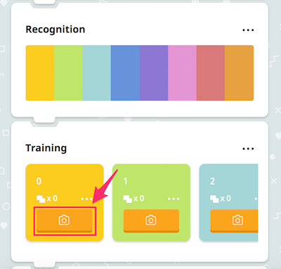
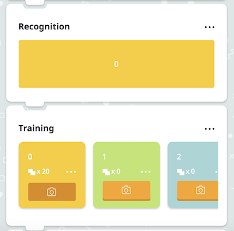
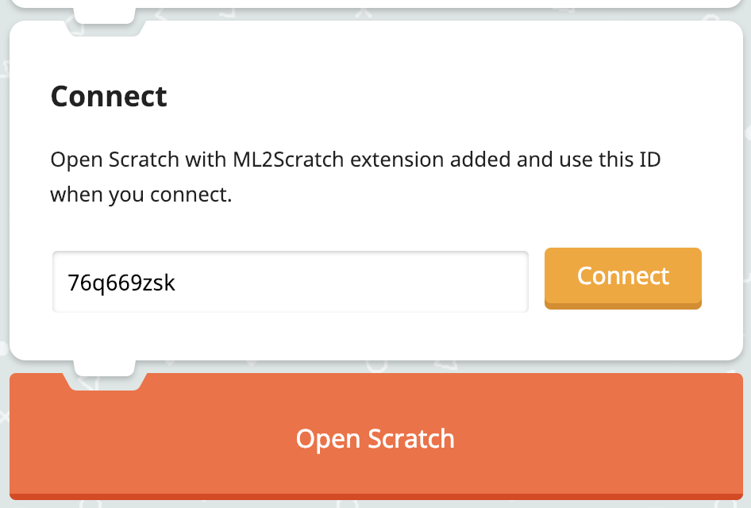
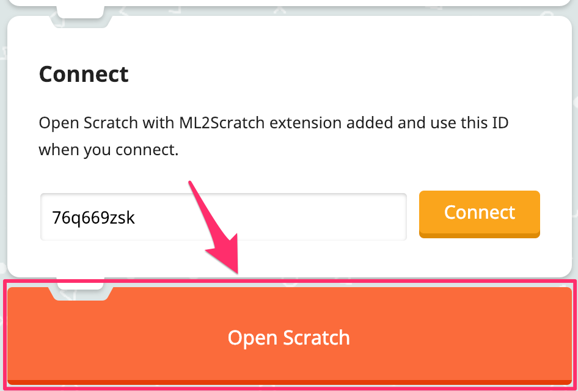
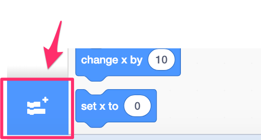
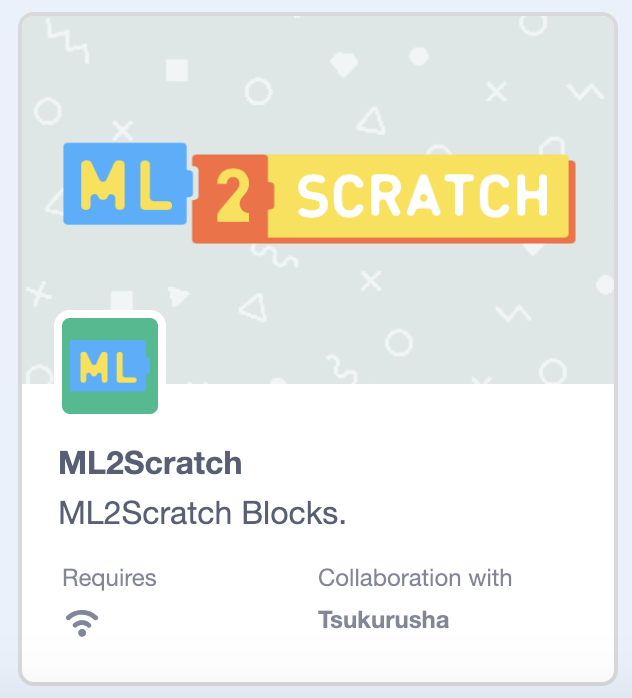
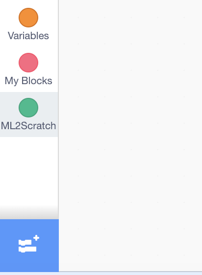
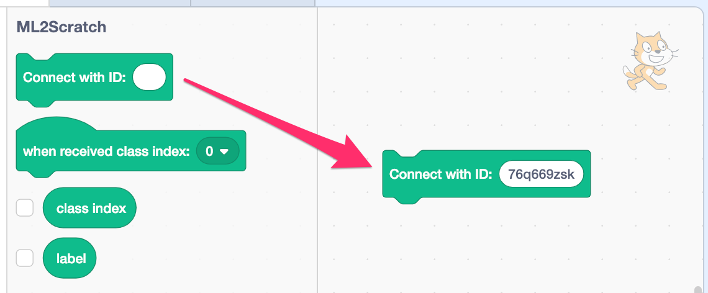
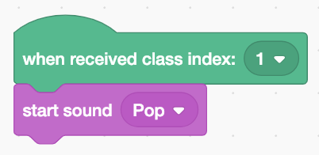

# ML2Scratch(Scratch2ML)

ML2Scratch connects Machine Learning(TensorFlow.js) to Scratch.

*Read this in other languages: [English](README.md), [日本語](README.ja.md), [简体中文](README.zh-cn.md).*

## New Version(Beta)

- https://champierre.github.io/scratch3/

    

## Requirements

- Chrome browser

## Demo Movie

- Rock/Scissors/Paper Demo [YouTube](https://www.youtube.com/watch?v=DkH1hwc-Gb4) | [.mov file](https://s3.amazonaws.com/champierre/movies/rsp_demo.mov)
- Control a toy robot, MiP, by hand gestures [YouTube](https://www.youtube.com/watch?v=GKXimEB5WQg) | [.mov file](https://s3.amazonaws.com/champierre/movies/mip_demo.mov)

## How to use(Step by step)

1. Open https://champierre.github.io/ml2scratch/. Allow the access to the webcam if you are asked for it.

2. At first, you need to train the machine by giving several images. Take your first pose. For example, just sit in the front of webcam and do nothing.

    

3. Keep clicking the camera button on the yellow card-type panel(label 0) in the Training section. This action captures the sample image to be recognized as label number 0.

    

    After you give about 20 images, the Recognition shows whole yellow bar. This means the neutral image is now recognized as label 0 with 100% assurance.

    

4. Next, you need to train the machine by giving images of another pose.

    

5. Keep clicking the camera button on the light green card-type panel(label 1) in the Training section. This action captures the sample image to be recognized as label number 1.

    

    After you give about 20 images, the Recognition will show whole light green bar. This means the image is now recognized as label 1 with 100% assurance(Maybe less like 80% - 90%, but it is OK if it is more than 70%).

    

6. Make sure that Recognition shows the label according to your pose. If you make the first neutral pose, it should show yellow bar. If you make the second pose, it should switch to green bar.

7. Scroll to the Connect section and copy the connection ID(characters such as "76q669zsk") next to "Connect" button. You need it later. Then, click "Connect" button to connect to the WebSocket server on the cloud.

    

8. Click "Open Scratch" button to open Scratch with ML2Scratch extension added.

    

    [Caution❗] Please open ML2Scratch and Scratch on different windows as shown in the following capture screen. If you open them in different tabs of the same window, they will not work.

    

9. Scratch will be opened in other tab. Under "Welcome to the Scratch 3.0 Beta" message, click "Try It!" button.

    On the left lower corner, click the folder icon to choose an extension.

    

    Then, select "ML2Scratch".

    

    "ML2Scratch" category will be added.

    

10. Drag "Connect with ID: []" block to the script area and paste the connection ID you copied on line 7 into the blank area. Once pasted, click the block to connect to the WebSocket server.

    

11. Drag "When received class index:[1]" block to the script area. Drag "start sound Pop" under "Sound" category to the script area and connect them as following.

    

12. Each time you take the pose for label 1, it is recognized as "label 1", that information is sent to Scratch via WebSocket server, and pop sound will be played as you programmed to do so.

## How to use(Advanced)

1. If you want to redo the training for specific label, select "Reset" on the menu for each label.

    

2. If you want to clear all the training data, select "Reset all" in Training section.

    

3. If you want to download training data, select "Download trained model" in Recognition section, then select the target folder. The file is JSON file, such as "1548166739008.json".

    

4. If you want to upload training data, select "Choose File..." in Trained Model section. Then, select the JSON file that you downloaded previously.

    

## How to develop

```
% npm install
% npm run start
```

## Reference

- https://js.tensorflow.org/
- https://github.com/googlecreativelab/teachable-machine-boilerplate
