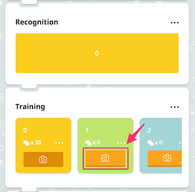
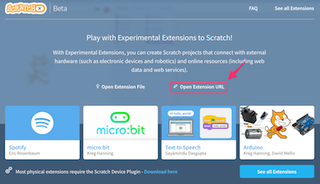
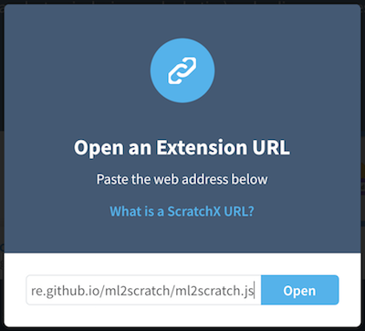

# ML2Scratch(Scratch2ML)

ML2Scratch connects Machine Learning(TensorFlow.js) to ScratchX.

*Read this in other languages: [English](README.md), [日本語](README.ja.md), [简体中文](README.zh-cn.md).*

## Requirements

- Chrome browser

## Demo Movie

- Rock/Scissors/Paper Demo [YouTube](https://www.youtube.com/watch?v=DkH1hwc-Gb4) | [.mov file](https://s3.amazonaws.com/champierre/movies/rsp_demo.mov)
- Control a toy robot, MiP, by hand gestures [YouTube](https://www.youtube.com/watch?v=GKXimEB5WQg) | [.mov file](https://s3.amazonaws.com/champierre/movies/mip_demo.mov)

## How to use

1. Open https://champierre.github.io/ml2scratch/. Allow the access to the webcam if you are asked for it.

2. At first, you need to train the machine by giving several images. Take your first pose. For example, just sit in the front of webcam and do nothing.

    

3. Keep clicking the camera button on the orange card-type panel(label 1) in the Training section. This action captures the sample image to be recognized as label number 1.

  

  After you give about 20 images, the Recognition shows whole orange bar. This means the neutral image is now recognized as label 1 with 100% assurance.

  

4. Next, you need to train the machine by giving images of another pose.

  

5. Keep clicking the camera button on the light green card-type panel(label 2) in the Training section. This action captures the sample image to be recognized as label number 2.

  

  After you give about 20 images, the Recognition will show whole light green bar. This means the image is now recognized as label 2 with 100% assurance(Maybe less like 80% - 90%, but it is OK if it is more than 70%).

  

6. Make sure that Recognition shows the label according to your pose. If you make the first neutral pose, it should show orange bar. If you make the second pose, it should switch to green bar.

7. Scroll to the Connect section and click "Connect" button to connect to the WebSocket server on the cloud. In order to paste it later, copy the connection ID(characters such as "76q669zsk") next to "Connect" button.

  

8. Click "Open ScratchX" button to open ScratchX.

  

9. ScratchX will be opened in other tab. Warning dialog appears. Click "I understand, continue" if you trust me :)

  

  The main page of ScratchX with ML2Scratch extension blocks(the dark purple blocks) will be opened.

  

  <blockquote>
  If the warning dialog does not opened and you are still on the ScratchX top page, click "Open Extension URL".

  

  Input the following extension URL on "Open an Extension URL" dialog and click "Open".

  ```
  https://champierre.github.io/ml2scratch/ml2scratch.js
  ```

  

  The main page of ScratchX will be opened.

10. On ScratchX screen, drag "Connect with ID: []" block to the script area and paste the connection ID you copied(See 7) into the blank area. Once pasted, click the block to connect to the WebSocket server.

  

11. Connect blocks as follows so that "When received label 1", "play sound pop".

  

12. Each time you take the pose for label 1, pop sound will be played.

13. If you want to redo the training for specific label, select "Reset" on the menu for each label.

  

14. If you want to clear all the training data, select "Reset" in Training section.

  

## How to develop

```
% npm install
% npm run start
```

## Reference

- https://js.tensorflow.org/
- https://github.com/googlecreativelab/teachable-machine-boilerplate
