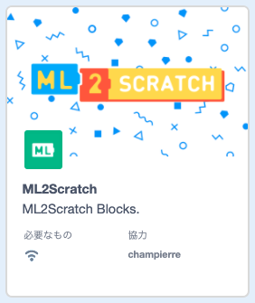
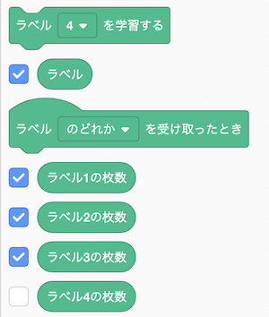
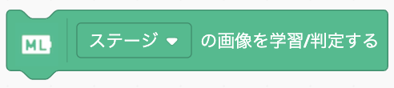
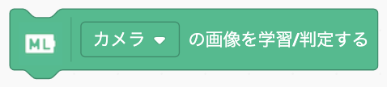
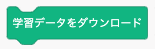
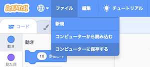
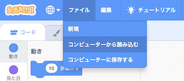
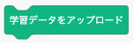
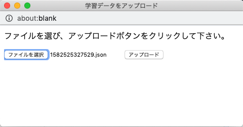

# ML2Scratch(Scratch2ML)

ML2Scratchは[TensorFlow.js](https://www.tensorflow.org/js)を使った機械学習をScratchから簡単に体験、利用できるようにします。

Webカメラでいくつかの画像を撮り、ラベルを付けて学習すれば、似たような新たな画像を、学習結果をもとに分類することができます。キャプチャした画像はサーバーに送られることはなく、学習および分類はすべてブラウザ上で行われるのが特徴です。（ただし、起動時にアプリケーションを読み込むのと、学習モデルをダウンロードするためにはネットワーク接続が必要です。）

ブロックの言語は、English、日本語、にほんご、简体中文(陶旭 https://twitter.com/taoxu_toukyoku 提供)、繁體中文(CAVEDU Education https://github.com/cavedunissin 提供)、に対応しています。その他の言語への翻訳にご協力いただける方がいましたら、Issue に登録いただくか、連絡先までご連絡ください。

*他の言語で読む: [English](README.en.md), [日本語](README.md), [简体中文](README.zh-cn.md).*

[ML2Scratch ホームページ](https://champierre.github.io/ml2scratch/)


## Demo Movie(デモ動画)

### ステージの画像を学習

  

- [手書き数字(1or2)認識 サンプルプロジェクト](https://github.com/champierre/ml2scratch/blob/master/sample_projects/1or2.sb3?raw=true)
- [手書き数字(1or2)認識 学習データ](https://github.com/champierre/ml2scratch/blob/master/sample_projects/1or2.json?raw=true)

### Webカメラの画像を学習

  

#### その他のデモ動画

- Webカメラでグー、チョキ、パーを判定 [YouTube](https://www.youtube.com/watch?v=DkH1hwc-Gb4) | [.mov file](https://s3.amazonaws.com/champierre/movies/rsp_demo.mov)
- ジェスチャーで倒立2輪ロボットMiPを動かす [YouTube](https://www.youtube.com/watch?v=GKXimEB5WQg) | [.mov file](https://s3.amazonaws.com/champierre/movies/mip_demo.mov)

## Licence(ライセンス)

- ML2Scratchには [BSD 3-Clause License](./LICENSE.md) が適用されます。オープンソースで、誰でも自由に利用できます。授業やワークショップで使用でき、商用利用も認められています。あなたやあなたの生徒さんがML2Scratchを使用して何か面白いプロジェクトを作成したときは、ぜひハッシュタグ #ml2scratch を使用してSNSで共有するか、連絡先までお知らせください。以下の「活用例」に追加させていただきます。

## Contacts(連絡先)

- Twitter

    

## Examples of use(活用例)

- [機械学習で障害物を避けてみる #ML2Scratch #ev3](https://www.ogaworks.com/archives/11301)
- [ML2Scratchでワガラサウルスを動かしてみました！](https://www.facebook.com/azusa.amino/videos/2408305165934138/)
- [イラストで扇風機をコントロール](https://www.facebook.com/groups/scratch.microbit/permalink/704715526600743/)
- [小学生が作った「未来のゴミ箱」は自律走行＆機械学習でゴミ分別　IoTセンサーで外の環境を検知！JJPC 全国小中学生プログラミング大会レポート](https://robotstart.info/2019/10/20/jjpc-4thprog-competition.html)
- [Scratchとmicro:bitでコイン選別AIロボットを作る](http://make-lab.sakura.ne.jp/wordpress/2019/10/12/scratch%e3%81%a8microbit%e3%81%a7%e3%82%b3%e3%82%a4%e3%83%b3%e9%81%b8%e5%88%a5ai%e3%83%ad%e3%83%9c%e3%83%83%e3%83%88%e3%82%92%e4%bd%9c%e3%82%8b/)
- [ジャスミンボトルで前進、缶コーヒーで後進(動画)](https://www.facebook.com/groups/visualprogramming.jp/permalink/531024724134426/)
- [ML2Scratchで本棚整理チェック(動画)](https://www.youtube.com/watch?v=ZQ88E6HSUdg)
- [ML2Scratchで駐車場の満空検知(動画)](https://www.youtube.com/watch?v=vZwfN18op8w)

## Requirements(推奨環境)

- OS
  - Windows 8
  - Windows 10
  - MacOS
  - Chrome OS
  - iOS
- ブラウザ
  - Chrome
  - Safari(iOS)

Chrome の拡張機能を使用している場合に、正常に動作しないことがあるので、もしうまく動かないという場合には、[ゲストモード](https://support.google.com/chrome/answer/6130773?hl=ja)に切り替えてお試しください。

## How to use(使い方)

### Setup(準備)

1. [https://stretch3.github.io/](https://stretch3.github.io/) をChromeで開きます。

2. 「拡張機能を選ぶ」画面を開き、「ML2Scratch」を選びます。

    

3. Chromeがカメラの使用の許可を求めるダイアログが表示されるので、「許可」をクリックします。

4. 「ラベル」、「ラベル1の枚数」、「ラベル2の枚数」、「ラベル3の枚数」の横のチェックボックスにチェックを入れます。

    

### Training(学習)

5. ジャンケンの「グー」のサインをカメラに映し、「ラベル1を学習する」ブロックをクリックします。この操作で、「グー」をラベル1として機械に学習させます。

    

6. 撮った写真の枚数が20枚になるまで「ラベル1を学習する」ブロックをクリックし続けます。撮った写真の枚数はステージ上の「ラベル1の枚数」に表示されています。

7. 次に「パー」をカメラに映し、同様に「ラベル2の枚数」が20になるまで、「ラベル2を学習する」ブロックをクリックし続けます。

8. 「チョキ」をカメラに映し、「ラベル3の枚数」が20になるまで、「ラベル3を学習する」ブロックをクリックし続けます。

### Recognition(認識)

9. 学習を終えると、認識結果が常にステージ上の「ラベル」に表示されるようになります。「グー」を見せれば「1」に、「パー」を見せれば「2」に、「チョキ」を見せれば「3」と表示されます。

    

10. 「ラベル◯◯を受け取ったとき」ブロックを使って、以下のようなサンプルプログラムを作ることができます。

    

### 学習/判定する画像の切り替え

学習/判定する画像を切り替えることができます。

デフォルトではScratchのステージ画像を学習/判定に使っています。



ステージにWebカメラの画像を映していれば、Webカメラの画像を学習/判定しますし、「ビデオを切にする」ブロックでWebカメラの画像を映すのをやめて、ゲームやアニメーションの画面などを表示した場合は、その画面を学習/判定に使用します。

「ビデオを入にする」でWebカメラの画像を映すと同時に、ゲームやアニメーションのキャラクターも表示しているのだけれども、Webカメラの画像だけを学習/判定したい場合には、



で学習/判定する画像をWebカメラの画像に切り替えることができます。カメラの画像に映ったジェスチャーでキャラクターを動かしたいという場合は、こちらの方が精度良く判定できると思います。

### Download/Upload(学習データとプロジェクトのダウンロード/アップロード)

ML2Scratch では、学習したモデルを「学習データをダウンロード」ブロックを使うことで、PC上にダウンロードして保存しておくことができます。



をクリックし、ファイルのダウンロード先を指定して「保存」ボタンを押すと <数字の列>.json というファイルとして学習データが保存されます。

プロジェクト自体は、通常の Scratch とは違って自動で保存されないので、「ファイル」>「コンピューターに保存する」を選び、.sb3 ファイルとして自分の PC 上に保存します。



保存しておいたプロジェクトを再び開くには、「ファイル」>「コンピューターから読み込む」を選び、保存してあった .sb3 ファイルを選びます。そのあとに学習データをアップロードします。



保存しておいた学習データは、「学習データをアップロード」ブロックでアップロードすることができます。



をクリックすると、「学習データをアップロード」というウィンドウが開くので、「ファイルを選択」ボタンをクリックして、学習データのファイル(<数字の列>.json)を選んだあと、「アップロード」ボタンをクリックします。



このとき、いままで学習していたデータは上書きされてしまうので注意してください。

## How to use from Xcratch(Xcratch からの利用)

ML2Scratch は必要な独自拡張機能を読み込むことができる Scratch Mod の「[Xcratch](https://lab.yengawa.com/project/xcratch/)」からも利用できます。

Xcratch の URL である [https://yokobond.github.io/xcratch/](https://yokobond.github.io/xcratch/) をブラウザで開き、「拡張機能を選ぶ」画面から「拡張機能を読み込む」を選んでから URL 入力欄に https://champierre.github.io/ml2scratch/ml2scratch.mjs を入力するか、以下のプロジェクトファイル付き URL から直接アクセスすれば、すでに ML2Scratch の拡張機能を読み込み済みの状態で Xcratch を開くことができます。

&raquo; [ML2Scratch を読み込み済みの Xcratch を開く](https://yokobond.github.io/xcratch/?project=https://champierre.github.io/ml2scratch/sample.sb3)

## For Developers - How to run ML2Scratch extension on your computer

1. Setup LLK/scratch-gui on your computer.

    ```
    % git clone git@github.com:LLK/scratch-gui.git
    % cd scratch-gui
    % npm install
    ```

2. In scratch-gui folder, clone ML2Scratch. You will have ml2scratch folder under scratch-gui.

    ```
    % git clone git@github.com:champierre/ml2scratch.git
    ```

3. Run the install script.

    ```
    % sh ml2scratch/install.sh
    ```

4. Run Scratch, then go to http://localhost:8601/.

    ```
    % npm start
    ```

## Tシャツ

ML2Scratchのロゴ入りTシャツ、こちらで販売しています ->
[https://suzuri.jp/is8r_/1251743/t-shirt/s/white](https://suzuri.jp/is8r_/1251743/t-shirt/s/white)

## Release Notes

- 1.0.0 2018/04/09 ScratchXバージョン
- 2.0.0 2019/01/20 Scratch3バージョン
- 3.0.0 2020/03/28 Scratchのステージ画像を学習/判定できるようにした。
- 3.0.1 2020/03/29 デフォルトで、カメラの画像を学習/判定するようにする。ラベル名を自由に設定できるようにする。
- 3.0.2 2020/04/18 「ビデオを切にする」と「カメラの画像を学習/判定する」などのブロックを続けて使用した時、あとに続けたブロックが実行されないバグを修正しました。

## Reference(参考)

- [https://js.tensorflow.org/](https://js.tensorflow.org/)
- [https://github.com/googlecreativelab/teachable-machine-boilerplate](https://github.com/googlecreativelab/teachable-machine-boilerplate)
