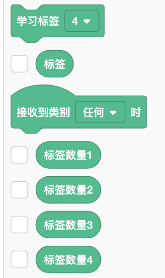

# ML2Scratch(Scratch2ML)

使用ML2Scratch可以将机器学习 ([TensorFlow.js](https://www.tensorflow.org/js))与Scratch连接起来。

如果使用网络摄像头拍摄一些图像，对其进行标记并进行学习，则可以根据学习结果对相似的新图像进行分类。捕获的图像不会发送到服务器，并且所有学习和分类都在浏览器中执行。 （但是，需要网络连接才能在启动时加载应用程序并下载学习模型。）

*其他语言说明页: [English](README.en.md), [日本語](README.md), [简体中文](README.zh-cn.md).*

[ML2Scratch Website](https://champierre.github.io/ml2scratch/)


## Demo Movie(演示视频)

### Learn/Classify Scratch stage images

  

- [handwriting(1or2) recognition sample project](https://github.com/champierre/ml2scratch/blob/master/sample_projects/1or2.sb3?raw=true)
- [handwriting(1or2) recognition learning data](https://github.com/champierre/ml2scratch/blob/master/sample_projects/1or2.json?raw=true)

### Learn/Classify Scratch webcam images

  

#### Other samples

- 用电脑摄像头判别石头剪子布 [.mov file](https://s3.amazonaws.com/champierre/movies/rsp_demo.mov) | [YouTube](https://www.youtube.com/watch?v=DkH1hwc-Gb4)
- 用手势指挥倒立两轮机器人MiP [.mov file](https://s3.amazonaws.com/champierre/movies/mip_demo.mov) | [YouTube](https://www.youtube.com/watch?v=GKXimEB5WQg)

## License(许可证)

- ML2Scratch受 [BSD 3-Clause License](./LICENSE.md) 的保护，是开源的，任何人均可免费使用。您可以在您的课堂，讲习班上使用它。商业用途也被接受。如果您或您的学生使用ML2Scratch创建了一些很棒的东西，请使用 #ml2scratch 标签在SNS上分享，或者让我知道这些联系人中的任何一个。有趣的项目将添加到“使用例”中。

## Contacts(联络人)

- WeChat

    

- Twitter

    

## Examples of use(使用例)

- [尝试避免机器学习的障碍＃ML2Scratch＃ev3(Google Translated)](https://translate.google.com/translate?hl=&sl=ja&tl=zh-CN&u=https%3A%2F%2Fwww.ogaworks.com%2Farchives%2F11301)
- [使用ML2Scratch控制Wagara-saurus（日式恐龙）](https://www.facebook.com/azusa.amino/videos/2408305165934138/)
- [用插图控制电风扇]((https://www.facebook.com/groups/scratch.microbit/permalink/704715526600743/))
- [智能垃圾箱](日文)](https://robotstart.info/2019/10/20/jjpc-4thprog-competition.html)
- [使用Scratch和micro:bit制作硬币分类AI机器人](http://make-lab.sakura.ne.jp/wordpress/2019/10/12/making-a-coin-sorting-ai-robot-with-scratch-and-micro-bit/)
- [用茉莉花瓶向前走，用罐装咖啡向后走(电影)](https://www.facebook.com/groups/visualprogramming.jp/permalink/531024724134426/)
- [ML2Scratch书架排列检查(电影)](https://www.youtube.com/watch?v=ZQ88E6HSUdg)
- [ML2Scratch检测到停车位已满(电影)](https://www.youtube.com/watch?v=vZwfN18op8w)

## Requirements(运行环境)

- OS
  - Windows 8
  - Windows 10
  - MacOS
  - Chrome OS
  - iOS
- Browser
  - Chrome
  - Safari(iOS)

由于某些Chrome扩展程序，ML2Scratch有时不起作用。 在这种情况下，请切换到访客模式。

## How to use(用法)

### Setup(设定)

1. 打开 [https://stretch3.github.io/](https://stretch3.github.io/)。

2. 打开“选择扩展”窗口，然后选择“ML2Scratch”。

    

3. Chrome要求您允许访问相机，然后单击“允许”。

4. 选中“标签”，“标签1的计数”，“标签2的计数”和“标签3的计数”块旁边的复选框。

    

### Training(训练)

5. 向摄像机显示“摇滚”手势，然后单击“火车标签1”块。 这是为了训练机器将“岩石”符号识别为标签1。

    

6. 持续单击该按钮，直到捕获约20张图像。 捕获的图像数量显示在“阶段”窗口的“标签数量1”字段中。

7. 在相机上显示“纸”手势，并继续单击“火车标签2”块，直到获得20作为“标签2的数量”。

8. 在相机上显示“剪刀”手势，并继续单击“火车标签3”块，直到获得20作为“标签3的数量”。

### Recognition(承认)

9. 训练后，识别结果将显示在“阶段”区域的“标签”字段中。 如果显示“ rock”，则“ label”应显示“ 1”，如果显示“ paper”，则“ label”应显示“ 2”，如果显示“ scissorsors”，则“ label”应显示“ 3” 。

    

10. 您可以使用“何时收到标签＃”块并创建一个示例程序，如下所示：

    

### Switching between images to be learned/classified

You can switch the images to be learned/classified.

By default, Scratch's stage image is used for learning/classification.


If there is a webcam image on the stage, it learns/classified the webcam image, or if the "Turn off video" block stops showing the webcam image and shows a game or animation screen, etc., it uses that screen for learning/classfication.

If you want to learn/classify only the webcam's image, you can use


It can be switch to a webcam image for learning/classification. If you want to move the character by gestures on the camera image, I think this is a more accurate way to judge.

### Download/Upload

With ML2Scratch, you can download and save the trained model on your PC by using the "download learning data" block.


Click, specify the file download destination, and press the "Save" button. The learning data will be saved as a file &lt;numerical string&gt;.json.

The project itself is not saved automatically like a normal Scratch, so select "File" > "Save to your computer" and save it on your PC as a .sb3 file.


To reopen a saved project, choose "File" > "Load from your computer" and select the saved .sb3 file. After that, upload the learning data.


The saved learning data can be uploaded in the "upload learning data" block.


When you click, a window called "upload learning data" opens, so click the "Select file" button, select the training data file (&lt;numerical sequence&gt;.json), and press Click.


At this time, be aware that the data that has been learned will be overwritten.

## For Developers - How to run ML2Scratch extension on your computer

1. Setup LLK/scratch-gui on your computer.

    ```
    % git clone git@github.com:LLK/scratch-gui.git
    % cd scratch-gui
    % npm install
    ```

2. In scratch-gui folder, clone ML2Scratch. You will have ml2scratch folder under scratch-gui.

    ```
    % git clone git@github.com:champierre/ml2scratch.git
    ```

3. Run the install script.

    ```
    % sh ml2scratch/install.sh
    ```

4. Run Scratch, then go to http://localhost:8601/.

    ```
    % npm start
    ```

## T-Shirt(文化衫)

这里销售印有ML2Scratch标志的文化衫 -> [https://suzuri.jp/is8r_/1251743/t-shirt/s/white](https://suzuri.jp/is8r_/1251743/t-shirt/s/white)

## Reference(参考链接)

- [https://js.tensorflow.org/](https://js.tensorflow.org/)
- [https://github.com/googlecreativelab/teachable-machine-boilerplate](https://github.com/googlecreativelab/teachable-machine-boilerplate)
