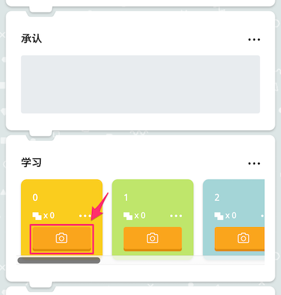
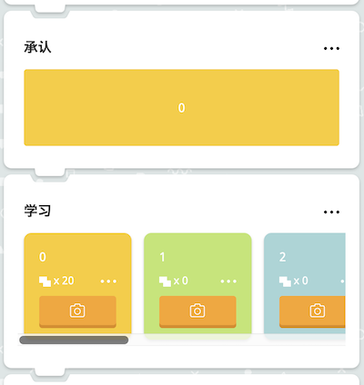
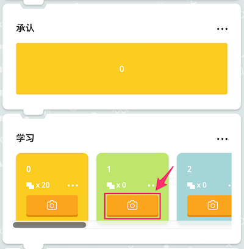
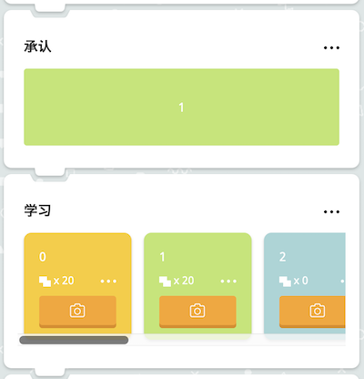
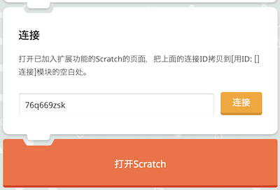
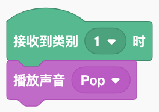
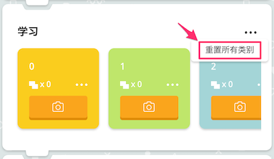

# ML2Scratch(Scratch2ML)

使用ML2Scratch可以将机器学习 (TensorFlow.js)与Scratch连接起来。

*其他语言说明页: [English](README.md), [日本語](README.ja.md), [简体中文](README.zh-cn.md).*

Chinese Translation by 陶旭(Tao Xu)<toukyoku@163.com>

## 运行环境

- Chrome浏览器

## 演示视频

- 用电脑摄像头判别石头剪子布 [.mov file](https://s3.amazonaws.com/champierre/movies/rsp_demo.mov) | [YouTube](https://www.youtube.com/watch?v=DkH1hwc-Gb4)
- 用手势指挥倒立两轮机器人MiP [.mov file](https://s3.amazonaws.com/champierre/movies/mip_demo.mov) | [YouTube](https://www.youtube.com/watch?v=GKXimEB5WQg)

## 用法

1. 打开 https://champierre.github.io/ml2scratch/ 。允许调用摄像头。

2. 实际开始前先来准备多张图片。例如坐在摄像头前，拍下可以看到脸但没有做动作的姿态。

    

3. 在“学习”一栏中，连续点击黄色板块上的照相机图标按钮，拍摄标签编号为0的识别图片。

    

    拍摄20张左右后，在“识别”栏中的状态条变为黄色。这表示没有做动作的姿态已经以100%的精度识别为标签0了。

    

4. 下面开始准备另一个姿态的图片。

    

5. 这时在"学习"栏中，连续点击浅绿色面板上的照相机图标的按钮，拍摄识别为标签编号1的图片。

    

    拍摄20张左右时，在“识别”栏中的状态条变为浅绿色。说明这个姿态的图片已经以100%的精度识别为标签1。（有可能是呈80%-90%的状态，但只要是超过70%就没有问题）

    

6. 这时应该可以看到"识别"栏中的颜色会对应于摄像头拍到的每个姿态发生变化。如果拍到第一个姿态则为黄色，如果是第二个姿态则会变成浅绿色了。

7. 滚动到页面最下方，复制"连接"栏中显示的连接ID（类似"76q669zsk"的随机字符串）。这个连接ID之后会用到。点击旁边的"连接"按钮，连接云端的WebSocket服务器。

    

8. 点击"打开Scratch"按钮，打开可以使用ML2Scratch的扩展功能的专用Scratch页面。

    

9. 这时在浏览器的新的选项卡中打开了Scratch的"欢迎来到Scratch 3.0 Beta版"页面，在这里点选"试用！"。点击窗口左下方的文件夹图标即可打开"选择一个扩展"的页面。

    

    选择最后面的"ML2Scratch"一项。

    

    这样就加好了"ML2Scratch"分类。

    

10. 把"用ID: []连接"积木拖到代码区域中，并把第7步中复制的连接ID粘贴在这里的空栏处。粘贴好以后可以点击积木，连接WebSocket服务器。

    

11. 把"接收到类别[1]时"积木拖到代码区域中。把"声音"分类中的"播放声音[喵]"拖到代码区域中，按照下图的方式拼接起来。

    

12. 每当读取到作为标签1而学习的姿态，则识别结果经由WebSocket服务器送达Scratch，按照Scratch中编的程序而发出喵的声音。

## 其他用法

1. 如果想修改针对某个标签的学习，则可以点击这个标签面板上的菜单（・・・），选择"重置"。

    

2. 如果想要把所有类别都清空，则可以点击“学习”栏的菜单（・・・）选择"重置所有类别"。

    

3. 如果想要保存学习的结果，可以在“识别”栏点击菜单（・・・）选择“下载”，指定保存路径。保存的文件为类似“1548166739008.json”的.json文件。

    

4. 如果想要上传已经保存的学习模型，则在"学习模型"栏点击"选取文件"，可以选择已经下载的.json文件。

    

## 开发环境设置

```
% npm install
% npm run start
```

## 文化衫

这里销售印有ML2Scratch标志的文化衫 -> https://suzuri.jp/is8r_/1251743/t-shirt/s/white

## 参考链接

- https://js.tensorflow.org/
- https://github.com/googlecreativelab/teachable-machine-boilerplate
